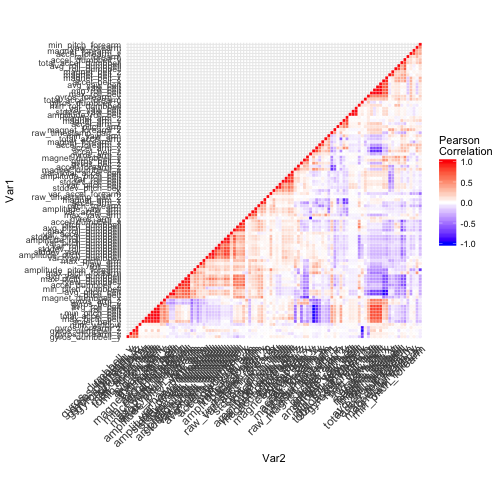
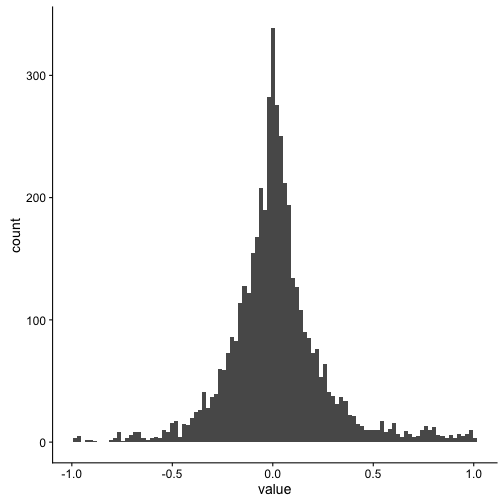

## Instructions

One thing that people regularly do is quantify how much of a particular activity they do, but they rarely quantify how well they do it. In this project, your goal will be to use data from accelerometers on the belt, forearm, arm, and dumbell of 6 participants.

#What you should submit

The goal of your project is to predict the manner in which they did the exercise. This is the "classe" variable in the training set. You may use any of the other variables to predict with. You should create a report describing how you built your model, how you used cross validation, what you think the expected out of sample error is, and why you made the choices you did. You will also use your prediction model to predict 20 different test cases.

link: http://web.archive.org/web/20161224072740/http:/groupware.les.inf.puc-rio.br/har
link data:  http://web.archive.org/web/20161224072740/http:/groupware.les.inf.puc-rio.br/har

## Background of the data

Six young health participants were asked to perform one set of 10 repetitions of the Unilateral Dumbbell Biceps Curl in five different fashions: exactly according to the specification (Class A), throwing the elbows to the front (Class B), lifting the dumbbell only halfway (Class C), lowering the dumbbell only halfway (Class D) and throwing the hips to the front (Class E).
The data for this project come from this source: http://groupware.les.inf.puc-rio.br/har. 
Class A corresponds to the specified execution of the exercise, while the other 4 classes correspond to common mistakes. Participants were supervised by an experienced weight lifter to make sure the execution complied to the manner they were supposed to simulate. The exercises were performed by six male participants aged between 20-28 years, with little weight lifting experience. We made sure that all participants could easily simulate the mistakes in a safe and controlled manner by using a relatively light dumbbell (1.25kg). 

Read more: http://web.archive.org/web/20161224072740/http:/groupware.les.inf.puc-rio.br/har#ixzz4p9pxiYPa

Read more: http://web.archive.org/web/20161224072740/http:/groupware.les.inf.puc-rio.br/har#ixzz4p9pXE5b7
##Loading the data

```r
library(caret)
library(ggplot2)
library(data.table)
library(cowplot)
library(knitr)
library(pander)
Testing <- data.table(read.csv("pml-testing.csv"))
Training <- data.table(read.csv("pml-training.csv"))
```

## Exploring and cleaning the data
We will focus on the training data. The following steps are used to clean and adjust the data.

* Drop out variables that are near zero variability
* Drop out variables that are nearly collinear
* Drop out variables that should not be predictors out of logic
* Drop out variables that have too many NAs & have complese cases of the predictors

### Near Zero Variability

60 variables have been cut off as their variability does not meet the standards required.

```r
cols <- nearZeroVar(Training)
length(cols)
```

```
## [1] 60
```

```r
dropped1<- Training[,.SD,.SDcols=cols]
pander(names(dropped1))
```

_new_window_, _kurtosis_roll_belt_, _kurtosis_picth_belt_, _kurtosis_yaw_belt_, _skewness_roll_belt_, _skewness_roll_belt.1_, _skewness_yaw_belt_, _max_yaw_belt_, _min_yaw_belt_, _amplitude_yaw_belt_, _avg_roll_arm_, _stddev_roll_arm_, _var_roll_arm_, _avg_pitch_arm_, _stddev_pitch_arm_, _var_pitch_arm_, _avg_yaw_arm_, _stddev_yaw_arm_, _var_yaw_arm_, _kurtosis_roll_arm_, _kurtosis_picth_arm_, _kurtosis_yaw_arm_, _skewness_roll_arm_, _skewness_pitch_arm_, _skewness_yaw_arm_, _max_roll_arm_, _min_roll_arm_, _min_pitch_arm_, _amplitude_roll_arm_, _amplitude_pitch_arm_, _kurtosis_roll_dumbbell_, _kurtosis_picth_dumbbell_, _kurtosis_yaw_dumbbell_, _skewness_roll_dumbbell_, _skewness_pitch_dumbbell_, _skewness_yaw_dumbbell_, _max_yaw_dumbbell_, _min_yaw_dumbbell_, _amplitude_yaw_dumbbell_, _kurtosis_roll_forearm_, _kurtosis_picth_forearm_, _kurtosis_yaw_forearm_, _skewness_roll_forearm_, _skewness_pitch_forearm_, _skewness_yaw_forearm_, _max_roll_forearm_, _max_yaw_forearm_, _min_roll_forearm_, _min_yaw_forearm_, _amplitude_roll_forearm_, _amplitude_yaw_forearm_, _avg_roll_forearm_, _stddev_roll_forearm_, _var_roll_forearm_, _avg_pitch_forearm_, _stddev_pitch_forearm_, _var_pitch_forearm_, _avg_yaw_forearm_, _stddev_yaw_forearm_ and _var_yaw_forearm_

```r
Training1 <- Training[,.SD,.SDcols=-cols]
```
## Collinear Variables


```r
library(reshape2)
numeric_cols <- Training1[,sapply(.SD,is.numeric)]
cormat <- Training1[,cor(.SD,use="pairwise.complete.obs"),.SDcols=numeric_cols]
##helper function used from sthda website
reorder_cormat <- function(cormat){
# Use correlation between variables as distance
dd <- as.dist((1-cormat)/2)
hc <- hclust(dd)
cormat <-cormat[hc$order, hc$order]
}
# Reorder the correlation matrix
cormat <- reorder_cormat(cormat)
# Get lower triangle of the correlation matrix
  get_lower_tri<-function(cormat){
    cormat[upper.tri(cormat)] <- NA
    return(cormat)
  }
  # Get upper triangle of the correlation matrix
  get_upper_tri <- function(cormat){
    cormat[lower.tri(cormat)]<- NA
    return(cormat)
  }
upper_tri <- get_upper_tri(cormat)
# Melt the correlation matrix
melted_cormat <- melt(upper_tri, na.rm = TRUE)
# Create a ggheatmap
ggheatmap <- ggplot(melted_cormat, aes(Var2, Var1, fill = value))+
 geom_tile(color = "white")+
 scale_fill_gradient2(low = "blue", high = "red", mid = "white", 
   midpoint = 0, limit = c(-1,1), space = "Lab", 
    name="Pearson\nCorrelation") +
  theme_minimal()+ # minimal theme
 theme(axis.text.x = element_text(angle = 45, vjust = 1, 
    size = 12, hjust = 1))+
 coord_fixed()
```

I have selected 

```r
#code for ggheatmap has been hidden because it takes too much space for this assignment. Kindly check github for it.
# Print the heatmap
ggheatmap
```



```r
melted_cormat <- data.table(melted_cormat)

ggplot(data=melted_cormat[value!=1,],aes(value)) + geom_histogram(bins=100) 
```



```r
above_0.9 <- melted_cormat[value!=1,][value>0.9|value< -0.9,]
above_0.9 <- above_0.9[order(-abs(value),Var1), ]
kable(head(above_0.9,5))
```


|Var1          |Var2           |      value|
|:-------------|:--------------|----------:|
|pitch_belt    |avg_pitch_belt |  0.9984979|
|roll_belt     |avg_roll_belt  |  0.9978058|
|yaw_belt      |avg_yaw_belt   |  0.9967579|
|min_roll_belt |avg_yaw_belt   |  0.9936679|
|roll_belt     |accel_belt_z   | -0.9920085|

I decided to dropp the following variables from the Training set due to the high correlations above 0.9 and below -0.9. 


```r
name_todrop2<- above_0.9[,unique(Var1)]
Training2 <- Training1[,.SD,.SDcols=-as.character(name_todrop2)]
```

We have left 73 predictors and 19622 observations.

```r
dim(Training2)
```

```
## [1] 19622    74
```

## Interprettable predictors.

The response is the variable class with 5 levels: A, B, C, D, E as mentioned in the background section of this assignment.

```r
Training2[,levels(classe)]
```

```
## [1] "A" "B" "C" "D" "E"
```


