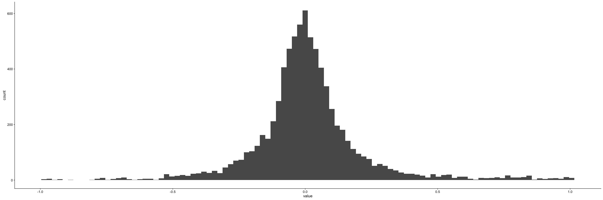
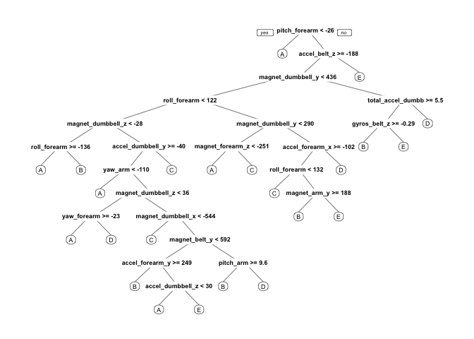

-   [Background of the data](#background-of-the-data)
-   [Loading the data](#loading-the-data)
-   [Exploring and cleaning the data](#exploring-and-cleaning-the-data)
-   [Collinear Variables](#collinear-variables)
-   [Interprettable predictors](#interprettable-predictors)
-   [Missing values](#missing-values)
-   [Selected variables to use
    as predictors.](#selected-variables-to-use-as-predictors.)
-   [Models used with adjusted Training
    data](#models-used-with-adjusted-training-data)
-   [Prediction/ Forecasting of the 20
    classes](#prediction-forecasting-of-the-20-classes)

Background of the data
----------------------

Six young health participants were asked to perform one set of 10
repetitions of the Unilateral Dumbbell Biceps Curl in five different
fashions: exactly according to the specification (Class A), throwing the
elbows to the front (Class B), lifting the dumbbell only halfway (Class
C), lowering the dumbbell only halfway (Class D) and throwing the hips
to the front (Class E). The data for this project come from this source:
<http://groupware.les.inf.puc-rio.br/har>. Class A corresponds to the
specified execution of the exercise, while the other 4 classes
correspond to common mistakes. Participants were supervised by an
experienced weight lifter to make sure the execution complied to the
manner they were supposed to simulate. The exercises were performed by
six male participants aged between 20-28 years, with little weight
lifting experience. We made sure that all participants could easily
simulate the mistakes in a safe and controlled manner by using a
relatively light dumbbell (1.25kg).

Read more:
<http://web.archive.org/web/20161224072740/http:/groupware.les.inf.puc-rio.br/har#ixzz4p9pxiYPa>

Read more:
<http://web.archive.org/web/20161224072740/http:/groupware.les.inf.puc-rio.br/har#ixzz4p9pXE5b7>

Loading the data
----------------

The required packages are mainly below but others are shown in the code
afterwards when required. There data has been divided into 70% training
and 30% testing for cross validation. The validation data is for
prediction at the end of the paper.

    library(caret)
    library(ggplot2)
    library(data.table)
    library(cowplot)
    library(knitr)
    library(rpart)
    library(rpart.plot)
    library(pander)
    library(kableExtra)
    options(knitr.tableformat="html")
    Testing_forprediction <- data.table(read.csv("pml-testing.csv", na.strings=c("NA","#DIV/0!","")))
    Data <- data.table(read.csv("pml-training.csv",na.strings=c("NA","#DIV/0!","")))
    set.seed(123)
    #Partitioning the training set into 2
    inTrain <- createDataPartition(Data$classe,p=0.70,list=FALSE)
    Training <- Data[inTrain,]
    Testing <- Data[-inTrain,]

Exploring and cleaning the data
-------------------------------

We will focus on the training data. The following steps are used to
clean and adjust the data.

-   Drop out variables that are near zero variability
-   Drop out variables that are nearly collinear
-   Drop out variables that should not be predictors out of logic
-   Drop out variables that have too many NAs & have complese cases of
    the predictors

The aim is to have predictors that matter for the final prediction.
Afterwards we need to check if the validation data has the proper
classes and names as the training data.

### Near Zero Variability

Many variables have been cut off as their variability does not meet the
standards required.

    cols <- nearZeroVar(Training)
    nearZeroVar(Training, saveMetrics=T)

    ##                          freqRatio percentUnique zeroVar   nzv
    ## X                         1.000000  100.00000000   FALSE FALSE
    ## user_name                 1.110114    0.04367766   FALSE FALSE
    ## raw_timestamp_part_1      1.000000    6.09303341   FALSE FALSE
    ## raw_timestamp_part_2      1.000000   89.48096382   FALSE FALSE
    ## cvtd_timestamp            1.014409    0.14559220   FALSE FALSE
    ## new_window               46.532872    0.01455922   FALSE  TRUE
    ## num_window                1.000000    6.24590522   FALSE FALSE
    ## roll_belt                 1.034375    8.08764650   FALSE FALSE
    ## pitch_belt                1.204918   12.17150761   FALSE FALSE
    ## yaw_belt                  1.077348   13.15425493   FALSE FALSE
    ## total_accel_belt          1.077358    0.21110868   FALSE FALSE
    ## kurtosis_roll_belt        2.000000    2.03829075   FALSE FALSE
    ## kurtosis_picth_belt       1.000000    1.70342870   FALSE FALSE
    ## kurtosis_yaw_belt         0.000000    0.00000000    TRUE  TRUE
    ## skewness_roll_belt        1.000000    2.03829075   FALSE FALSE
    ## skewness_roll_belt.1      1.000000    1.79806362   FALSE FALSE
    ## skewness_yaw_belt         0.000000    0.00000000    TRUE  TRUE
    ## max_roll_belt             1.142857    1.15745796   FALSE FALSE
    ## max_picth_belt            1.625000    0.15287181   FALSE FALSE
    ## max_yaw_belt              1.181818    0.39309893   FALSE FALSE
    ## min_roll_belt             1.125000    1.12105991   FALSE FALSE
    ## min_pitch_belt            2.157895    0.10919415   FALSE FALSE
    ## min_yaw_belt              1.181818    0.39309893   FALSE FALSE
    ## amplitude_roll_belt       1.304348    0.85899396   FALSE FALSE
    ## amplitude_pitch_belt      3.276596    0.09463493   FALSE FALSE
    ## amplitude_yaw_belt        0.000000    0.00727961    TRUE  TRUE
    ## var_total_accel_belt      1.482143    0.40765815   FALSE FALSE
    ## avg_roll_belt             1.090909    1.13561913   FALSE FALSE
    ## stddev_roll_belt          1.000000    0.45861542   FALSE FALSE
    ## var_roll_belt             1.648148    0.56780957   FALSE FALSE
    ## avg_pitch_belt            1.000000    1.26665211   FALSE FALSE
    ## stddev_pitch_belt         1.086957    0.28390478   FALSE FALSE
    ## var_pitch_belt            1.159420    0.40765815   FALSE FALSE
    ## avg_yaw_belt              1.125000    1.37584625   FALSE FALSE
    ## stddev_yaw_belt           1.875000    0.37126010   FALSE FALSE
    ## var_yaw_belt              1.354839    0.87355318   FALSE FALSE
    ## gyros_belt_x              1.072034    0.92451045   FALSE FALSE
    ## gyros_belt_y              1.153819    0.46589503   FALSE FALSE
    ## gyros_belt_z              1.064205    1.20113562   FALSE FALSE
    ## accel_belt_x              1.068519    1.17201718   FALSE FALSE
    ## accel_belt_y              1.122109    0.99730654   FALSE FALSE
    ## accel_belt_z              1.055921    2.11836646   FALSE FALSE
    ## magnet_belt_x             1.108871    2.21300138   FALSE FALSE
    ## magnet_belt_y             1.103604    2.08196841   FALSE FALSE
    ## magnet_belt_z             1.002924    3.15207105   FALSE FALSE
    ## roll_arm                 47.560000   17.36186940   FALSE FALSE
    ## pitch_arm                76.741935   20.28827255   FALSE FALSE
    ## yaw_arm                  30.487179   19.10897576   FALSE FALSE
    ## total_accel_arm           1.079872    0.48045425   FALSE FALSE
    ## var_accel_arm             7.000000    2.06012958   FALSE FALSE
    ## avg_roll_arm             49.000000    1.75438596   FALSE  TRUE
    ## stddev_roll_arm          49.000000    1.75438596   FALSE  TRUE
    ## var_roll_arm             49.000000    1.75438596   FALSE  TRUE
    ## avg_pitch_arm            49.000000    1.75438596   FALSE  TRUE
    ## stddev_pitch_arm         49.000000    1.75438596   FALSE  TRUE
    ## var_pitch_arm            49.000000    1.75438596   FALSE  TRUE
    ## avg_yaw_arm              49.000000    1.75438596   FALSE  TRUE
    ## stddev_yaw_arm           51.000000    1.73982675   FALSE  TRUE
    ## var_yaw_arm              51.000000    1.73982675   FALSE  TRUE
    ## gyros_arm_x               1.010753    4.61527262   FALSE FALSE
    ## gyros_arm_y               1.490411    2.66433719   FALSE FALSE
    ## gyros_arm_z               1.056848    1.70342870   FALSE FALSE
    ## accel_arm_x               1.133929    5.57618112   FALSE FALSE
    ## accel_arm_y               1.165605    3.79995632   FALSE FALSE
    ## accel_arm_z               1.068182    5.60529956   FALSE FALSE
    ## magnet_arm_x              1.101695    9.65276261   FALSE FALSE
    ## magnet_arm_y              1.016129    6.22406639   FALSE FALSE
    ## magnet_arm_z              1.012987    9.11407149   FALSE FALSE
    ## kurtosis_roll_arm         1.000000    1.73982675   FALSE FALSE
    ## kurtosis_picth_arm        1.000000    1.73254714   FALSE FALSE
    ## kurtosis_yaw_arm          2.000000    2.04557036   FALSE FALSE
    ## skewness_roll_arm         1.000000    1.74710636   FALSE FALSE
    ## skewness_pitch_arm        1.000000    1.73254714   FALSE FALSE
    ## skewness_yaw_arm          1.000000    2.05284997   FALSE FALSE
    ## max_roll_arm             16.333333    1.60151416   FALSE FALSE
    ## max_picth_arm             8.166667    1.50687923   FALSE FALSE
    ## max_yaw_arm               1.058824    0.36398049   FALSE FALSE
    ## min_roll_arm             16.333333    1.55783650   FALSE FALSE
    ## min_pitch_arm            12.250000    1.55783650   FALSE FALSE
    ## min_yaw_arm               1.052632    0.26206595   FALSE FALSE
    ## amplitude_roll_arm       24.500000    1.66703065   FALSE  TRUE
    ## amplitude_pitch_arm      17.000000    1.63791221   FALSE FALSE
    ## amplitude_yaw_arm         1.187500    0.36398049   FALSE FALSE
    ## roll_dumbbell             1.009804   86.31433355   FALSE FALSE
    ## pitch_dumbbell            2.000000   84.32700007   FALSE FALSE
    ## yaw_dumbbell              1.133333   85.69556672   FALSE FALSE
    ## kurtosis_roll_dumbbell    1.000000    2.05284997   FALSE FALSE
    ## kurtosis_picth_dumbbell   1.000000    2.06740919   FALSE FALSE
    ## kurtosis_yaw_dumbbell     0.000000    0.00000000    TRUE  TRUE
    ## skewness_roll_dumbbell    2.000000    2.07468880   FALSE FALSE
    ## skewness_pitch_dumbbell   1.000000    2.06740919   FALSE FALSE
    ## skewness_yaw_dumbbell     0.000000    0.00000000    TRUE  TRUE
    ## max_roll_dumbbell         1.333333    1.78350440   FALSE FALSE
    ## max_picth_dumbbell        1.000000    1.82718206   FALSE FALSE
    ## max_yaw_dumbbell          1.000000    0.45133581   FALSE FALSE
    ## min_roll_dumbbell         1.000000    1.79806362   FALSE FALSE
    ## min_pitch_dumbbell        1.000000    1.91453738   FALSE FALSE
    ## min_yaw_dumbbell          1.000000    0.45133581   FALSE FALSE
    ## amplitude_roll_dumbbell   7.000000    1.99461309   FALSE FALSE
    ## amplitude_pitch_dumbbell  7.000000    1.96549465   FALSE FALSE
    ## amplitude_yaw_dumbbell    0.000000    0.00727961    TRUE  TRUE
    ## total_accel_dumbbell      1.074816    0.30574361   FALSE FALSE
    ## var_accel_dumbbell        5.000000    1.97277426   FALSE FALSE
    ## avg_roll_dumbbell         1.000000    2.05284997   FALSE FALSE
    ## stddev_roll_dumbbell     14.000000    2.00917231   FALSE FALSE
    ## var_roll_dumbbell        14.000000    2.00917231   FALSE FALSE
    ## avg_pitch_dumbbell        1.000000    2.05284997   FALSE FALSE
    ## stddev_pitch_dumbbell    14.000000    2.00917231   FALSE FALSE
    ## var_pitch_dumbbell       14.000000    2.00917231   FALSE FALSE
    ## avg_yaw_dumbbell          1.000000    2.05284997   FALSE FALSE
    ## stddev_yaw_dumbbell      14.000000    2.00917231   FALSE FALSE
    ## var_yaw_dumbbell         14.000000    2.00917231   FALSE FALSE
    ## gyros_dumbbell_x          1.006961    1.71070831   FALSE FALSE
    ## gyros_dumbbell_y          1.286064    1.92181699   FALSE FALSE
    ## gyros_dumbbell_z          1.058962    1.43408313   FALSE FALSE
    ## accel_dumbbell_x          1.031111    2.95552158   FALSE FALSE
    ## accel_dumbbell_y          1.052023    3.27582442   FALSE FALSE
    ## accel_dumbbell_z          1.159509    2.89728471   FALSE FALSE
    ## magnet_dumbbell_x         1.068376    7.78918250   FALSE FALSE
    ## magnet_dumbbell_y         1.257812    6.02023732   FALSE FALSE
    ## magnet_dumbbell_z         1.021429    4.79726287   FALSE FALSE
    ## roll_forearm             11.118367   13.62742957   FALSE FALSE
    ## pitch_forearm            61.886364   18.99978161   FALSE FALSE
    ## yaw_forearm              16.106509   12.90674820   FALSE FALSE
    ## kurtosis_roll_forearm     1.000000    1.62335299   FALSE FALSE
    ## kurtosis_picth_forearm    1.000000    1.61607338   FALSE FALSE
    ## kurtosis_yaw_forearm      0.000000    0.00000000    TRUE  TRUE
    ## skewness_roll_forearm     1.000000    1.63063260   FALSE FALSE
    ## skewness_pitch_forearm    2.000000    1.60879377   FALSE FALSE
    ## skewness_yaw_forearm      0.000000    0.00000000    TRUE  TRUE
    ## max_roll_forearm         21.666667    1.40496469   FALSE  TRUE
    ## max_picth_forearm         2.708333    0.88083279   FALSE FALSE
    ## max_yaw_forearm           1.277778    0.26934556   FALSE FALSE
    ## min_roll_forearm         21.666667    1.46320157   FALSE  TRUE
    ## min_pitch_forearm         4.062500    0.98274732   FALSE FALSE
    ## min_yaw_forearm           1.277778    0.26934556   FALSE FALSE
    ## amplitude_roll_forearm   21.666667    1.53599767   FALSE  TRUE
    ## amplitude_pitch_forearm   4.785714    1.01914537   FALSE FALSE
    ## amplitude_yaw_forearm     0.000000    0.00727961    TRUE  TRUE
    ## total_accel_forearm       1.088664    0.50229308   FALSE FALSE
    ## var_accel_forearm         3.000000    2.08924802   FALSE FALSE
    ## avg_roll_forearm         32.500000    1.63063260   FALSE  TRUE
    ## stddev_roll_forearm      68.000000    1.61607338   FALSE  TRUE
    ## var_roll_forearm         68.000000    1.61607338   FALSE  TRUE
    ## avg_pitch_forearm        65.000000    1.63791221   FALSE  TRUE
    ## stddev_pitch_forearm     65.000000    1.63791221   FALSE  TRUE
    ## var_pitch_forearm        65.000000    1.63791221   FALSE  TRUE
    ## avg_yaw_forearm          65.000000    1.63791221   FALSE  TRUE
    ## stddev_yaw_forearm       67.000000    1.62335299   FALSE  TRUE
    ## var_yaw_forearm          67.000000    1.62335299   FALSE  TRUE
    ## gyros_forearm_x           1.074792    2.06012958   FALSE FALSE
    ## gyros_forearm_y           1.029412    5.24859868   FALSE FALSE
    ## gyros_forearm_z           1.137313    2.14020528   FALSE FALSE
    ## accel_forearm_x           1.047619    5.67809565   FALSE FALSE
    ## accel_forearm_y           1.000000    7.11217879   FALSE FALSE
    ## accel_forearm_z           1.185185    4.04746306   FALSE FALSE
    ## magnet_forearm_x          1.000000   10.61367111   FALSE FALSE
    ## magnet_forearm_y          1.163934   13.37264323   FALSE FALSE
    ## magnet_forearm_z          1.000000   11.84392517   FALSE FALSE
    ## classe                    1.469526    0.03639805   FALSE FALSE

    length(cols)# number of variables dropped

    ## [1] 32

    head(cols,10)

    ##  [1]  6 14 17 26 51 52 53 54 55 56

    dropped1 <- Training[,.SD,.SDcols=cols]
    Training1 <- Training[,.SD,.SDcols=-cols]

Collinear Variables
-------------------

I have selected

    #code for ggheatmap has been hidden because it takes too much space for this assignment. Kindly check github for it.
    # Print the heatmap
    ggheatmap

    melted_cormat <- data.table(melted_cormat)

    ggplot(data=melted_cormat[value!=1,],aes(value)) + geom_histogram(bins=100) 

    above_0.9 <- melted_cormat[value!=1,][value>0.9|value< -0.9,]
    above_0.9 <- above_0.9[order(-abs(value),Var1), ]
    kable(head(above_0.9,5))

<table>
<thead>
<tr class="header">
<th align="left">Var1</th>
<th align="left">Var2</th>
<th align="right">value</th>
</tr>
</thead>
<tbody>
<tr class="odd">
<td align="left">kurtosis_roll_dumbbell</td>
<td align="left">max_yaw_dumbbell</td>
<td align="right">0.9999717</td>
</tr>
<tr class="even">
<td align="left">kurtosis_roll_dumbbell</td>
<td align="left">min_yaw_dumbbell</td>
<td align="right">0.9999717</td>
</tr>
<tr class="odd">
<td align="left">kurtosis_roll_forearm</td>
<td align="left">max_yaw_forearm</td>
<td align="right">0.9999501</td>
</tr>
<tr class="even">
<td align="left">kurtosis_roll_forearm</td>
<td align="left">min_yaw_forearm</td>
<td align="right">0.9999501</td>
</tr>
<tr class="odd">
<td align="left">kurtosis_roll_belt</td>
<td align="left">max_yaw_belt</td>
<td align="right">0.9999291</td>
</tr>
</tbody>
</table>

I decided to drop the following variables from the Training set due to
the high correlations above 0.9 and below -0.9.

    name_todrop2<- above_0.9[,unique(Var1)]
    Training2 <- Training1[,.SD,.SDcols=-as.character(name_todrop2)]

We have left the following amount of observations and variables.

    dim(Training2)

    ## [1] 13737    98

Interprettable predictors
-------------------------

The response is the variable class with 5 levels: A, B, C, D, E as
mentioned in the background section of this assignment. The

    Training2[,levels(classe)]

    ## [1] "A" "B" "C" "D" "E"

    descr <- Training[,.N,by=c("classe","user_name")]
    kable(dcast(descr,user_name ~ classe), caption="amount of observations per user by class")

<table>
<caption>amount of observations per user by class</caption>
<thead>
<tr class="header">
<th align="left">user_name</th>
<th align="right">A</th>
<th align="right">B</th>
<th align="right">C</th>
<th align="right">D</th>
<th align="right">E</th>
</tr>
</thead>
<tbody>
<tr class="odd">
<td align="left">adelmo</td>
<td align="right">808</td>
<td align="right">544</td>
<td align="right">514</td>
<td align="right">364</td>
<td align="right">492</td>
</tr>
<tr class="even">
<td align="left">carlitos</td>
<td align="right">576</td>
<td align="right">485</td>
<td align="right">349</td>
<td align="right">339</td>
<td align="right">429</td>
</tr>
<tr class="odd">
<td align="left">charles</td>
<td align="right">616</td>
<td align="right">513</td>
<td align="right">377</td>
<td align="right">459</td>
<td align="right">487</td>
</tr>
<tr class="even">
<td align="left">eurico</td>
<td align="right">619</td>
<td align="right">426</td>
<td align="right">352</td>
<td align="right">404</td>
<td align="right">376</td>
</tr>
<tr class="odd">
<td align="left">jeremy</td>
<td align="right">836</td>
<td align="right">331</td>
<td align="right">456</td>
<td align="right">369</td>
<td align="right">386</td>
</tr>
<tr class="even">
<td align="left">pedro</td>
<td align="right">451</td>
<td align="right">359</td>
<td align="right">348</td>
<td align="right">317</td>
<td align="right">355</td>
</tr>
<tr class="odd">
<td align="left">All predicto</td>
<td align="right">rs see</td>
<td align="right">m to h</td>
<td align="right">ave an</td>
<td align="right">effec</td>
<td align="right">t on the classe however the time stamp is repeated in different format and therefore I discard both parts of the raw time stamp.</td>
</tr>
</tbody>
</table>

    Training2 <- Training2[,.SD,.SDcols= -c("raw_timestamp_part_1","raw_timestamp_part_2","user_name","cvtd_timestamp","X","num_window")]

Missing values
--------------

The missing values per variable are as follows:

    missing <-Training2[,lapply(.SD,is.na)][,lapply(.SD,sum)][,lapply(.SD,function(x){if(x>0) x})]

    length(missing)

    ## [1] 50

    missing[,1]/dim(Training2)[1]

    ##    kurtosis_picth_belt
    ## 1:           0.9803451

Most of the variables have the same amount of NAs which is about 98% of
the data. I further looked into it because I found it weird that the
near zero variance did not discard this variables. Therefore I supposed
these variables are relevant to a particular classe only. Apparently all
classes have the same number of missing values per classe for hte 24
variables that have 98% of missing values. I therefore drop these
variables.

    missing

    ##    kurtosis_picth_belt skewness_roll_belt skewness_roll_belt.1
    ## 1:               13467              13455                13467
    ##    max_yaw_belt min_yaw_belt var_total_accel_belt var_roll_belt
    ## 1:        13456        13456                13448         13448
    ##    avg_pitch_belt var_pitch_belt avg_yaw_belt var_yaw_belt var_accel_arm
    ## 1:          13448          13448        13448        13448         13448
    ##    kurtosis_roll_arm kurtosis_picth_arm kurtosis_yaw_arm skewness_roll_arm
    ## 1:             13498              13499            13455             13497
    ##    skewness_pitch_arm skewness_yaw_arm max_roll_arm max_picth_arm
    ## 1:              13499            13455        13448         13448
    ##    max_yaw_arm min_roll_arm min_pitch_arm min_yaw_arm amplitude_pitch_arm
    ## 1:       13448        13448         13448       13448               13448
    ##    amplitude_yaw_arm kurtosis_picth_dumbbell skewness_roll_dumbbell
    ## 1:             13448                   13450                  13451
    ##    skewness_pitch_dumbbell max_roll_dumbbell max_yaw_dumbbell
    ## 1:                   13449             13448            13452
    ##    min_roll_dumbbell min_pitch_dumbbell min_yaw_dumbbell
    ## 1:             13448              13448            13452
    ##    var_accel_dumbbell avg_roll_dumbbell var_roll_dumbbell
    ## 1:              13448             13448             13448
    ##    avg_pitch_dumbbell stddev_pitch_dumbbell avg_yaw_dumbbell
    ## 1:              13448                 13448            13448
    ##    stddev_yaw_dumbbell kurtosis_picth_forearm skewness_roll_forearm
    ## 1:               13448                  13515                 13513
    ##    skewness_pitch_forearm max_picth_forearm max_yaw_forearm
    ## 1:                  13515             13448           13514
    ##    min_pitch_forearm min_yaw_forearm amplitude_pitch_forearm
    ## 1:             13448           13514                   13448
    ##    var_accel_forearm
    ## 1:             13448

    M<-Training2[,.SD,.SDcols=c("classe",names(missing))]
    kable(M[,lapply(.SD,is.na),by=classe][,lapply(.SD,sum,na.rm=T),by=classe][,1:2])

<table>
<thead>
<tr class="header">
<th align="left">classe</th>
<th align="right">kurtosis_picth_belt</th>
</tr>
</thead>
<tbody>
<tr class="odd">
<td align="left">A</td>
<td align="right">3838</td>
</tr>
<tr class="even">
<td align="left">B</td>
<td align="right">2604</td>
</tr>
<tr class="odd">
<td align="left">C</td>
<td align="right">2348</td>
</tr>
<tr class="even">
<td align="left">D</td>
<td align="right">2209</td>
</tr>
<tr class="odd">
<td align="left">E</td>
<td align="right">2468</td>
</tr>
</tbody>
</table>

Selected variables to use as predictors.
----------------------------------------

We are left with fewer variables in the training data.

    Training3 <- Training2[,.SD,.SDcols= -names(missing)]
    dim(Training3)

    ## [1] 13737    42

    dim(Training3) == dim(na.omit(Training3))

    ## [1] TRUE TRUE

Models used with adjusted Training data
=======================================

-   Decision tree

We fit a predictive model for activity recognition using the decision
tree algorithm.

    tree_ <- rpart(classe ~ ., data=Training3, method="class")
    prp(tree_)

The performance of the model with the validation data is as follows:

    tree_out <- predict(tree_, Testing, type = "class")
    tree_ct <- confusionMatrix(Testing$classe, tree_out)
    tree_ct

    ## Confusion Matrix and Statistics
    ## 
    ##           Reference
    ## Prediction    A    B    C    D    E
    ##          A 1478   61   83   30   22
    ##          B  201  589  198  124   27
    ##          C   40  105  843   31    7
    ##          D   52  146  203  517   46
    ##          E   61  200  180  112  529
    ## 
    ## Overall Statistics
    ##                                           
    ##                Accuracy : 0.6722          
    ##                  95% CI : (0.6601, 0.6842)
    ##     No Information Rate : 0.3113          
    ##     P-Value [Acc > NIR] : < 2.2e-16       
    ##                                           
    ##                   Kappa : 0.5842          
    ##  Mcnemar's Test P-Value : < 2.2e-16       
    ## 
    ## Statistics by Class:
    ## 
    ##                      Class: A Class: B Class: C Class: D Class: E
    ## Sensitivity            0.8068   0.5350   0.5594  0.63514  0.83835
    ## Specificity            0.9516   0.8850   0.9582  0.91185  0.89475
    ## Pos Pred Value         0.8829   0.5171   0.8216  0.53631  0.48891
    ## Neg Pred Value         0.9159   0.8921   0.8633  0.93965  0.97876
    ## Prevalence             0.3113   0.1871   0.2561  0.13832  0.10722
    ## Detection Rate         0.2511   0.1001   0.1432  0.08785  0.08989
    ## Detection Prevalence   0.2845   0.1935   0.1743  0.16381  0.18386
    ## Balanced Accuracy      0.8792   0.7100   0.7588  0.77349  0.86655

    accuracy <- postResample(tree_out, Testing$classe)
    #show table
    tab <- tree_ct
    kable(tab[2],caption="confusion table of the tree model")

<table class="kable_wrapper">
<caption>
confusion table of the tree model
</caption>
<tbody>
<tr>
<td>
<table>
<thead>
<tr class="header">
<th></th>
<th align="right">A</th>
<th align="right">B</th>
<th align="right">C</th>
<th align="right">D</th>
<th align="right">E</th>
</tr>
</thead>
<tbody>
<tr class="odd">
<td>A</td>
<td align="right">1478</td>
<td align="right">61</td>
<td align="right">83</td>
<td align="right">30</td>
<td align="right">22</td>
</tr>
<tr class="even">
<td>B</td>
<td align="right">201</td>
<td align="right">589</td>
<td align="right">198</td>
<td align="right">124</td>
<td align="right">27</td>
</tr>
<tr class="odd">
<td>C</td>
<td align="right">40</td>
<td align="right">105</td>
<td align="right">843</td>
<td align="right">31</td>
<td align="right">7</td>
</tr>
<tr class="even">
<td>D</td>
<td align="right">52</td>
<td align="right">146</td>
<td align="right">203</td>
<td align="right">517</td>
<td align="right">46</td>
</tr>
<tr class="odd">
<td>E</td>
<td align="right">61</td>
<td align="right">200</td>
<td align="right">180</td>
<td align="right">112</td>
<td align="right">529</td>
</tr>
</tbody>
</table>

</td>
</tr>
</tbody>
</table>
    rm(tree_out)

The Accuracy is:

    kable(tab$overall)

<table>
<tbody>
<tr class="odd">
<td align="left">Accuracy</td>
<td align="right">0.6722175</td>
</tr>
<tr class="even">
<td align="left">Kappa</td>
<td align="right">0.5841515</td>
</tr>
<tr class="odd">
<td align="left">AccuracyLower</td>
<td align="right">0.6600565</td>
</tr>
<tr class="even">
<td align="left">AccuracyUpper</td>
<td align="right">0.6842075</td>
</tr>
<tr class="odd">
<td align="left">AccuracyNull</td>
<td align="right">0.3112999</td>
</tr>
<tr class="even">
<td align="left">AccuracyPValue</td>
<td align="right">0.0000000</td>
</tr>
<tr class="odd">
<td align="left">McnemarPValue</td>
<td align="right">0.0000000</td>
</tr>
</tbody>
</table>

-   Random Forest

It is quite accurate since at each split it has bootstrap variables. It
grows multiple trees and vote. We will use 4 fold cross validation when
applying the algorithm.

    #rf - random forest
    rf_ <- train(classe ~ ., data=Training3, method="rf", verbose=FALSE, trControl=trainControl(method ="cv",4), ntree = 250)
    #predict
    rf.out <- predict(rf_,newdata=Testing)
    #contigency table
    rf.ct <- confusionMatrix(rf.out,Testing$classe)
    #show table
    tab <- rf.ct
    kable(tab[2],caption="confusion table of the Random Forest model")

<table class="kable_wrapper">
<caption>
confusion table of the Random Forest model
</caption>
<tbody>
<tr>
<td>
<table>
<thead>
<tr class="header">
<th></th>
<th align="right">A</th>
<th align="right">B</th>
<th align="right">C</th>
<th align="right">D</th>
<th align="right">E</th>
</tr>
</thead>
<tbody>
<tr class="odd">
<td>A</td>
<td align="right">1672</td>
<td align="right">13</td>
<td align="right">0</td>
<td align="right">0</td>
<td align="right">0</td>
</tr>
<tr class="even">
<td>B</td>
<td align="right">2</td>
<td align="right">1122</td>
<td align="right">20</td>
<td align="right">0</td>
<td align="right">1</td>
</tr>
<tr class="odd">
<td>C</td>
<td align="right">0</td>
<td align="right">4</td>
<td align="right">1005</td>
<td align="right">32</td>
<td align="right">1</td>
</tr>
<tr class="even">
<td>D</td>
<td align="right">0</td>
<td align="right">0</td>
<td align="right">1</td>
<td align="right">931</td>
<td align="right">1</td>
</tr>
<tr class="odd">
<td>E</td>
<td align="right">0</td>
<td align="right">0</td>
<td align="right">0</td>
<td align="right">1</td>
<td align="right">1079</td>
</tr>
</tbody>
</table>

</td>
</tr>
</tbody>
</table>
    rm(rf_out)
    rm(rf_ct)

The Accuracy is:

    kable(tab$overall)

<table>
<tbody>
<tr class="odd">
<td align="left">Accuracy</td>
<td align="right">0.9870858</td>
</tr>
<tr class="even">
<td align="left">Kappa</td>
<td align="right">0.9836595</td>
</tr>
<tr class="odd">
<td align="left">AccuracyLower</td>
<td align="right">0.9838623</td>
</tr>
<tr class="even">
<td align="left">AccuracyUpper</td>
<td align="right">0.9898120</td>
</tr>
<tr class="odd">
<td align="left">AccuracyNull</td>
<td align="right">0.2844520</td>
</tr>
<tr class="even">
<td align="left">AccuracyPValue</td>
<td align="right">0.0000000</td>
</tr>
<tr class="odd">
<td align="left">McnemarPValue</td>
<td align="right">NaN</td>
</tr>
</tbody>
</table>

Prediction/ Forecasting of the 20 classes
=========================================

We use the validation data from the first section and predict the 20
classes with all the models. As they were all equally good. But before
we make sure that the predicted data has the same format as the training
and testing. We therefore need to coerce it into the same type of data.

    Model.tree <- predict(tree_,Testing_forprediction)
    Model.rf <- predict(rf_,Testing_forprediction)

    result_predictions = data.frame(Model.tree)
    kable(data.frame(result_predictions), caption=" results for the final quiz")

<table>
<caption>results for the final quiz</caption>
<thead>
<tr class="header">
<th align="right">A</th>
<th align="right">B</th>
<th align="right">C</th>
<th align="right">D</th>
<th align="right">E</th>
</tr>
</thead>
<tbody>
<tr class="odd">
<td align="right">0.0298063</td>
<td align="right">0.1445604</td>
<td align="right">0.5176354</td>
<td align="right">0.1500248</td>
<td align="right">0.1579732</td>
</tr>
<tr class="even">
<td align="right">0.7664234</td>
<td align="right">0.1690998</td>
<td align="right">0.0121655</td>
<td align="right">0.0237226</td>
<td align="right">0.0285888</td>
</tr>
<tr class="odd">
<td align="right">0.9636511</td>
<td align="right">0.0363489</td>
<td align="right">0.0000000</td>
<td align="right">0.0000000</td>
<td align="right">0.0000000</td>
</tr>
<tr class="even">
<td align="right">0.9754098</td>
<td align="right">0.0245902</td>
<td align="right">0.0000000</td>
<td align="right">0.0000000</td>
<td align="right">0.0000000</td>
</tr>
<tr class="odd">
<td align="right">0.7330097</td>
<td align="right">0.0194175</td>
<td align="right">0.0436893</td>
<td align="right">0.0291262</td>
<td align="right">0.1747573</td>
</tr>
<tr class="even">
<td align="right">0.0298063</td>
<td align="right">0.1445604</td>
<td align="right">0.5176354</td>
<td align="right">0.1500248</td>
<td align="right">0.1579732</td>
</tr>
<tr class="odd">
<td align="right">0.0639854</td>
<td align="right">0.1371115</td>
<td align="right">0.0383912</td>
<td align="right">0.6910420</td>
<td align="right">0.0694698</td>
</tr>
<tr class="even">
<td align="right">0.0496032</td>
<td align="right">0.1666667</td>
<td align="right">0.0337302</td>
<td align="right">0.6369048</td>
<td align="right">0.1130952</td>
</tr>
<tr class="odd">
<td align="right">0.9636511</td>
<td align="right">0.0363489</td>
<td align="right">0.0000000</td>
<td align="right">0.0000000</td>
<td align="right">0.0000000</td>
</tr>
<tr class="even">
<td align="right">0.7664234</td>
<td align="right">0.1690998</td>
<td align="right">0.0121655</td>
<td align="right">0.0237226</td>
<td align="right">0.0285888</td>
</tr>
<tr class="odd">
<td align="right">0.0298063</td>
<td align="right">0.1445604</td>
<td align="right">0.5176354</td>
<td align="right">0.1500248</td>
<td align="right">0.1579732</td>
</tr>
<tr class="even">
<td align="right">0.0000000</td>
<td align="right">0.5921053</td>
<td align="right">0.1348684</td>
<td align="right">0.1217105</td>
<td align="right">0.1513158</td>
</tr>
<tr class="odd">
<td align="right">0.0298063</td>
<td align="right">0.1445604</td>
<td align="right">0.5176354</td>
<td align="right">0.1500248</td>
<td align="right">0.1579732</td>
</tr>
<tr class="even">
<td align="right">0.9636511</td>
<td align="right">0.0363489</td>
<td align="right">0.0000000</td>
<td align="right">0.0000000</td>
<td align="right">0.0000000</td>
</tr>
<tr class="odd">
<td align="right">0.0766284</td>
<td align="right">0.1417625</td>
<td align="right">0.0421456</td>
<td align="right">0.2030651</td>
<td align="right">0.5363985</td>
</tr>
<tr class="even">
<td align="right">0.0170455</td>
<td align="right">0.0000000</td>
<td align="right">0.0000000</td>
<td align="right">0.0681818</td>
<td align="right">0.9147727</td>
</tr>
<tr class="odd">
<td align="right">0.6575342</td>
<td align="right">0.0958904</td>
<td align="right">0.0834371</td>
<td align="right">0.1145704</td>
<td align="right">0.0485679</td>
</tr>
<tr class="even">
<td align="right">0.0997067</td>
<td align="right">0.4076246</td>
<td align="right">0.0058651</td>
<td align="right">0.3167155</td>
<td align="right">0.1700880</td>
</tr>
<tr class="odd">
<td align="right">0.0997067</td>
<td align="right">0.4076246</td>
<td align="right">0.0058651</td>
<td align="right">0.3167155</td>
<td align="right">0.1700880</td>
</tr>
<tr class="even">
<td align="right">0.0000000</td>
<td align="right">0.5921053</td>
<td align="right">0.1348684</td>
<td align="right">0.1217105</td>
<td align="right">0.1513158</td>
</tr>
</tbody>
</table>

    result_predictions = data.frame(Model.rf)
    kable(data.frame(result_predictions), caption=" results for the final quiz")

<table>
<caption>results for the final quiz</caption>
<thead>
<tr class="header">
<th align="left">Model.rf</th>
</tr>
</thead>
<tbody>
<tr class="odd">
<td align="left">B</td>
</tr>
<tr class="even">
<td align="left">A</td>
</tr>
<tr class="odd">
<td align="left">B</td>
</tr>
<tr class="even">
<td align="left">A</td>
</tr>
<tr class="odd">
<td align="left">A</td>
</tr>
<tr class="even">
<td align="left">E</td>
</tr>
<tr class="odd">
<td align="left">D</td>
</tr>
<tr class="even">
<td align="left">B</td>
</tr>
<tr class="odd">
<td align="left">A</td>
</tr>
<tr class="even">
<td align="left">A</td>
</tr>
<tr class="odd">
<td align="left">B</td>
</tr>
<tr class="even">
<td align="left">C</td>
</tr>
<tr class="odd">
<td align="left">B</td>
</tr>
<tr class="even">
<td align="left">A</td>
</tr>
<tr class="odd">
<td align="left">E</td>
</tr>
<tr class="even">
<td align="left">E</td>
</tr>
<tr class="odd">
<td align="left">A</td>
</tr>
<tr class="even">
<td align="left">B</td>
</tr>
<tr class="odd">
<td align="left">B</td>
</tr>
<tr class="even">
<td align="left">B</td>
</tr>
</tbody>
</table>

    write.table(result_predictions, "results.csv")
